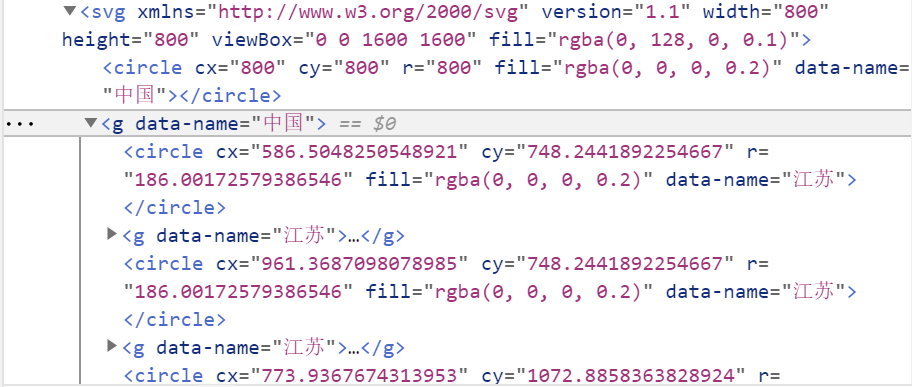
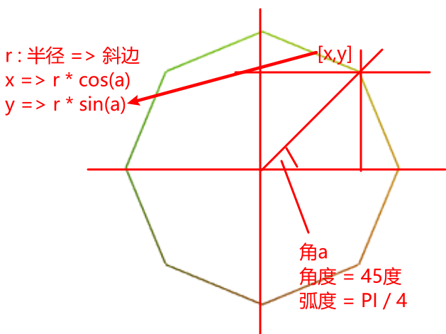

# 跟月影学可视化
## 随堂例子合集

SVG Dom结构




```javascript
// 生成多边形顶点坐标数组的函数
function createCircleVertex(x, y, r, n) {
  const sin = Math.sin;
  const cos = Math.cos;
  const perAngel = (2 * Math.PI) / n; // 这里n为4的话，是弧度制2PI / 4 => PI / 2 单位长度
  console.log(perAngel, 'perAngel');
  const positionArray = [];
  for (let i = 0; i < n; i++) {
    const angel = i * perAngel; // i 取值 0,1,2,3 => 0,PI / 2,PI,3*PI / 2
    const nx = r * cos(angel); // 半径为0.5 
    const ny = r * sin(angel);
    console.log([nx, ny], `PI * ${2 / n * i}`);
    positionArray.push(nx, ny);
  }
  // return new Float32Array(positionArray);
  return positionArray;

}
```

图片详解：




